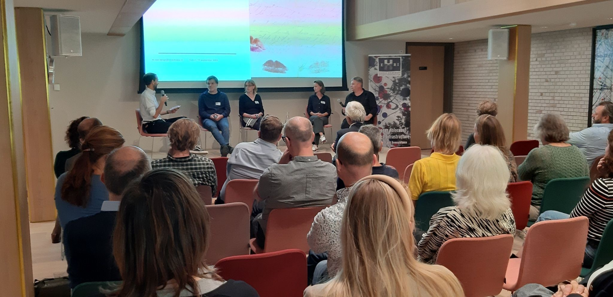


De derde consortiumbijeenkomst van EHRI-NL, het Nederlandse knooppunt van de European Holocaust Research Infrastructure (EHRI) vond plaats op 11 september 2024 in het auditorium van het [Nationaal Holocaustmuseum](https://jck.nl/locatie/nationaal-holocaustmuseum) in Amsterdam. We denken met plezier terug aan een informatieve middag, waarin zowel de digitalisering van CABR als de context waarin het archief tot stand is gekomen uitgebreid werden toegelicht.

Zo'n veertig deelnemers verzamelden zich om 13.00 uur in het auditorium voor een vol programma. Bijna alle aanwezigen waren onderzoekers, historici, wetenschappers, collectiespecialisten, schrijvers of archivarissen met een relatie tot de Holocaust of de Tweede Wereldoorlog. Verschillende Nederlandse instellingen, van de VU tot het Joods Cultureel Kwartier, van het Nationaal tot het Gelders Archief, van het NIOD tot Kamp Westenbork waren vertegenwoordigd.

Onderzoekers en archivarissen of collectiespecialisten samen op één bijeenkomst komt minder vaak voor dan je zou verwachten. Het thema was dan ook *'“Hoe Holocaustonderzoekers en archieven samen nieuwe inzichten genereren.” EHRI-NL's scholarly program in relation to the digitization of the Central Archive on Special Jurisdiction (CABR),'* waarbij dit archief als case study diende om de interactie tussen onderzoeker en collectiebeherende instelling te onderzoeken.

Na de introductie van het CABR onderzochten de deelnemers hoe de optimale samenwerking tussen archivaris en onderzoeker eruit zou kunnen zien, gebaseerd op deze specifieke casestudy. De belangrijkste gedeelde observatie was dat interactie tussen de twee domeinen kan helpen om blinde vlekken aan beide kanten te verhelpen. Diepere kennis over de achtergrond waartegen archieven en collecties werden gecreëerd, kan het bewustzijn van onderzoekers over de mogelijke selectieve aard en kleuring (bias) vergroten. Omgekeerd kunnen de kennis, ervaring en wensen van de onderzoeker de archivaris helpen om beter geïnformeerde acquisities te doen, te selecteren (voor digitalisering), te digitaliseren en te archiveren.

Als je meer wilt weten over EHRI-NL of de netwerkbijeenkomsten, neem dan contact op met ehri-nl@niod.knaw.nl voor meer informatie.

---

Beneden: De panelleden verkennen de optimale samenwerking tussen archivaris en onderzoeker. Van links naar rechts: Frank Uiterwaal (voorzitter: NIOD), Edwin Klijn (WO2NET), Petra Links (Gelders Archief), Marjolein Uittenbogaard (NIOD) en Robin te Slaa (zelfstandig onderzoeker).

